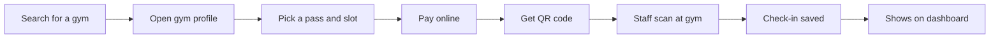
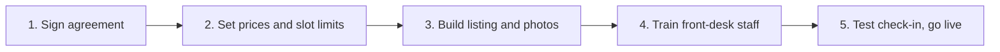

# GymAnywhere MVP: Functional Requirements Document

Logic Lumin Software · Prepared by Basava Sanketh B N (Business Analyst) · Version 1.0, February 2026

Builds on the [BRD](BRD.md). Every functional requirement here points back to a business requirement (BR) there.

### Revision history

| Version | Date | Change |
| --- | --- | --- |
| 0.1 | Jan 2026 | First draft of requirements and user stories |
| 0.2 | Jan 2026 | Added business rules and acceptance criteria after walkthrough with engineering |
| 0.3 | Feb 2026 | Changed login from email to mobile OTP after user feedback |
| 1.0 | Feb 2026 | Baselined for development |

---

## 1. What this document is for

The BRD says what the business needs. This document says what the app has to do to get there, in enough detail for the team to build it and for us to test it. If something here doesn't trace back to the BRD, it probably shouldn't be in the MVP.

## 2. Who uses the app

| Role | Who they are | What they can do |
| --- | --- | --- |
| Member | Anyone using the GymAnywhere app | Search gyms, buy passes, book a visit, check in and cancel |
| Gym staff | Front-desk staff at a partner gym | Scan QR codes and see today's bookings |
| Gym owner | The owner or manager | Everything staff can do, plus set slot limits and see earnings |
| Admin | Our team at Logic Lumin | Onboard gyms, manage listings and prices, run payouts and view KPIs |

## 3. The main flow

This is the path most of the MVP is built around.

## 4. Functional requirements

Priority is MoSCoW: M (Must), S (Should), C (Could).

### 4.1 Sign-up and finding a gym

| ID | Requirement | Priority | BR |
| --- | --- | --- | --- |
| FR-01 | Members sign up and log in with their mobile number and a one-time password (OTP). | M | BR-01 |
| FR-02 | The app lists every live partner gym in Mysuru with its name, area, distance, price per visit and photos. | M | BR-01 |
| FR-03 | Members can filter gyms by area, price and facilities such as cardio, weights, showers or parking. | M | BR-01 |
| FR-04 | Each gym has a profile page with its address, map, opening hours, facilities, photos and pass prices. | M | BR-01 |

### 4.2 Passes, booking and payment

| ID | Requirement | Priority | BR |
| --- | --- | --- | --- |
| FR-05 | Each gym offers single-visit and multi-visit passes. Prices are set by Admin. | M | BR-02 |
| FR-06 | Members pick a date and time slot and book a visit using a pass. | M | BR-02 |
| FR-07 | Payment is taken online through the payment gateway (UPI, card or net banking). The booking is confirmed only once payment goes through. | M | BR-02 |
| FR-08 | A slot can't be booked once it reaches the gym's limit. | S | BR-08 |
| FR-09 | Members can cancel a booking. The cancellation rule is in [BRL-04](#5-business-rules). | S | BR-10 |
| FR-10 | Members get a reminder 2 hours before their visit. | C | BR-11 |

### 4.3 QR check-in

| ID | Requirement | Priority | BR |
| --- | --- | --- | --- |
| FR-11 | Every confirmed booking gets its own QR code in the member's app. | M | BR-03 |
| FR-12 | Gym staff scan the QR code in the partner app and see valid or invalid within 3 seconds. | M | BR-03 |
| FR-13 | Each successful check-in is saved with the member, gym, booking and time. | M | BR-04 |
| FR-14 | A QR code is rejected if it has been used, cancelled, belongs to another gym or is for a different date. | M | BR-03 |
| FR-15 | Check-ins are sent to Google Analytics as they happen. | M | BR-04 |

### 4.4 Onboarding and the partner dashboard

| ID | Requirement | Priority | BR |
| --- | --- | --- | --- |
| FR-16 | Admin creates a gym listing and moves it through the 5 onboarding steps in [section 6](#6-onboarding-a-new-gym). | M | BR-05 |
| FR-17 | Admin creates owner and staff accounts for each gym. | M | BR-05 |
| FR-18 | Gym owners see today's bookings and check-ins along with their earnings for the week and month. | M | BR-06 |
| FR-19 | Gym owners set a limit for each time slot. | S | BR-08 |

### 4.5 Payouts and reporting

| ID | Requirement | Priority | BR |
| --- | --- | --- | --- |
| FR-20 | Weekly earnings for each gym = completed check-ins × visit price × the gym's share. | M | BR-07 |
| FR-21 | Admin gets a weekly payout report to check before paying gyms. | M | BR-07 |
| FR-22 | Booking, check-in and revenue data is exported daily for the weekly KPI sheet in Google Sheets. | M | BR-09 |

## 5. Business rules

| ID | Rule |
| --- | --- |
| BRL-01 | No payment, no booking. A failed payment doesn't hold the slot. |
| BRL-02 | A QR code works once, at the booked gym, on the booked date. |
| BRL-03 | Once a slot hits its limit, nobody else can book it. |
| BRL-04 | Cancel 2 hours or more before the slot and you get a full refund. After that, or if you don't show up, there's no refund. |
| BRL-05 | Gyms are paid for visits that actually happened, not for cancelled or unused bookings. |
| BRL-06 | A gym only goes live once all 5 onboarding steps are ticked off by Admin. |

## 6. Onboarding a new gym

Our first gym took nearly 3 weeks to go live because we were figuring it out as we went. These 5 steps are what we settled on. They got it under a week.

| Step | Who | Done when | Day |
| --- | --- | --- | --- |
| 1. Sign agreement | Admin with gym owner | Agreement signed with revenue share agreed | 1 |
| 2. Set prices and slot limits | Admin with gym owner | Pass prices and slot limits entered | 1 to 2 |
| 3. Build listing | Admin | Profile, photos, facilities and hours ready in staging | 2 to 3 |
| 4. Train staff | BA with front-desk staff | Staff can scan a code and read the dashboard | 3 to 4 |
| 5. Test and go live | BA with Admin | One test check-in works and the gym is visible in the app | 5 |

## 7. User stories

### 7.1 MVP backlog

| ID | Story | Priority | FR |
| --- | --- | --- | --- |
| US-01 | As a member, I want to sign up with my mobile number so I can start booking quickly. | M | FR-01 |
| US-02 | As a member, I want to see gyms near me so I can pick one that's easy to get to. | M | FR-02 |
| US-03 | As a member, I want to filter by price and facilities so I only see gyms that suit me. | M | FR-03 |
| US-04 | As a member, I want to see photos, timings and facilities so I know what I'm walking into. | M | FR-04 |
| US-05 | As a member, I want a single-visit pass so I can try a gym without signing up for a month. | M | FR-05 |
| US-06 | As a member, I want a multi-visit pass so each visit costs me less. | M | FR-05 |
| US-07 | As a member, I want to book a time slot so I know there'll be space. | M | FR-06, FR-08 |
| US-08 | As a member, I want to pay by UPI or card so booking takes less than a minute. | M | FR-07 |
| US-09 | As a member, I want a QR code for my booking so I don't have to fill in any register. | M | FR-11 |
| US-10 | As front-desk staff, I want to scan a member's code so I can let them in straight away. | M | FR-12, FR-13 |
| US-11 | As front-desk staff, I want a clear message when a code is invalid so I don't let in someone who hasn't paid. | M | FR-14 |
| US-12 | As a gym owner, I want to see today's bookings so I can plan my staff for the busy hours. | M | FR-18 |
| US-13 | As a gym owner, I want to see what I've earned so I can trust the payouts. | M | FR-18, FR-20 |
| US-14 | As a gym owner, I want to cap bookings per slot so the gym doesn't get overcrowded. | S | FR-19 |
| US-15 | As an admin, I want to track each gym through onboarding so none goes live half set up. | M | FR-16, FR-17 |
| US-16 | As an admin, I want a weekly payout report so gyms are paid the right amount. | M | FR-21 |
| US-17 | As a founder, I want weekly numbers so I can decide when to expand. | M | FR-22 |
| US-18 | As a member, I want to cancel a booking so I'm not charged if my plans change. | S | FR-09 |

### 7.2 Acceptance criteria for the stories that mattered most

**US-07: Book a slot**

- Given a slot has one place left, when a member books it and pays, then the booking is confirmed and the slot shows as full.
- Given a slot is full, when another member looks at it, then it's greyed out and can't be selected.

**US-10: Scan a code at the desk**

- Given a member has a booking for today at this gym, when staff scan the code, then the app shows "Valid, check in" within 3 seconds and saves the check-in with the time.
- Given the check-in is saved, when the owner opens the dashboard, then it's already there without refreshing.

**US-11: Reject a bad code**

- Given a code has already been used, when staff scan it again, then the app shows "Already used" and doesn't save a second check-in.
- Given a code is for another gym or another day, when staff scan it, then the app says why and blocks entry.

**US-13: See earnings**

- Given a gym had 40 check-ins this week, when the owner opens earnings, then the amount is 40 × visit price × the gym's share. Cancelled or unused bookings aren't counted.

**US-18: Cancel a booking**

- Given the visit is more than 2 hours away, when the member cancels, then the booking is cancelled, the slot opens up and the refund starts.
- Given the visit is less than 2 hours away, when the member tries to cancel, then the app tells them there's no refund before they confirm.

## 8. Non-functional requirements

| ID | Area | Requirement |
| --- | --- | --- |
| NFR-01 | Speed | QR scan result in under 3 seconds on 4G |
| NFR-02 | Speed | Gym search loads in under 2 seconds |
| NFR-03 | Uptime | 99% during gym hours (5 AM to 10 PM) |
| NFR-04 | Security | OTP login. Staff can't see earnings or other gyms' data |
| NFR-05 | Security | Card and UPI details stay with the payment gateway. We never store them |
| NFR-06 | Ease of use | A new staff member can learn the scanner in under 30 minutes |
| NFR-07 | Growth | Adding a new city shouldn't need changes to the core flows |

## 9. Decisions we made along the way

- **Mobile OTP instead of email login.** In testing, several people didn't remember which email they'd used. Almost everyone had their phone on them at the gym.
- **QR instead of NFC or a member card.** Every gym already had a phone at the desk. QR needed no extra hardware and could be rolled out the same day.
- **2-hour cancellation window.** Gym owners wanted 6 hours and members wanted no limit. Two hours was the compromise both sides could live with in UAT.
- **Slot limits (FR-08, FR-19) moved to release 1.1.** Both were Shoulds. We shipped them two weeks after launch so the launch date didn't slip.

## 10. Traceability

| BR | Functional requirements | User stories | What we tested in UAT |
| --- | --- | --- | --- |
| BR-01 Find a gym | FR-01 to FR-04 | US-01 to US-04 | Member finds a gym and opens its profile |
| BR-02 Buy and pay | FR-05 to FR-07 | US-05, US-06, US-08 | Member buys a pass and pays |
| BR-03 Check at the desk | FR-11, FR-12, FR-14 | US-09 to US-11 | Staff scan valid and invalid codes |
| BR-04 Live check-in data | FR-13, FR-15 | US-10 | Check-in shows on the dashboard and in Google Analytics |
| BR-05 Onboarding | FR-16, FR-17 | US-15 | A new gym goes through all 5 steps |
| BR-06 Partner dashboard | FR-18 | US-12, US-13 | Owner checks bookings and earnings |
| BR-07 Payouts | FR-20, FR-21 | US-13, US-16 | Payout report matches actual check-ins |
| BR-08 Slot limits | FR-08, FR-19 | US-07, US-14 | A full slot can't be booked |
| BR-09 Weekly KPIs | FR-22 | US-17 | KPI sheet updates from the daily export |
| BR-10 Cancellation | FR-09 | US-18 | Cancel before and after the 2-hour cut-off |
| BR-11 Reminders | FR-10 | | Reminder arrives 2 hours before the visit |

## 11. How we ran UAT

We tested at the gyms, on the staff's own phones, with owners and front-desk staff from all 4 gyms plus a small group of members. Every scenario in the table above was covered, including the awkward ones: used codes, codes for the wrong gym, full slots and late cancellations. We didn't go live until every Must requirement passed, there were no open critical or high bugs and both founders had signed off.
